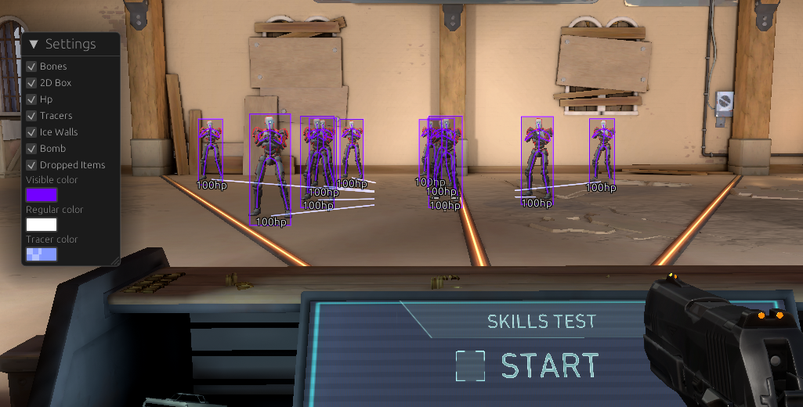

# Valox

This is a valorant hack leveraging many rust features to make it both easy to read and write code. It was made to show how to make an external in rust.
This project uses a custom made proc macro to convert an offset file to typechecked pointers making it easy to update and removes much of the boilerplate. 
All this is a subset of my private hack, and was put togheter over the weekend so there might be unused or useless code included. 
It uses a transparent topmost overlay with egui for drawing and cc for c++ decryption. The drawing itself is very simplistic by design and should be improved to suit your own need.

### Licence
This project (valox, memory, ue4-rs, memory, memory_macros) is GPLv3 and FOSS and that means that you cant sell this without making it open source too, so no P2C. However you are free to use it yourself.
https://gist.github.com/kn9ts/cbe95340d29fc1aaeaa5dd5c059d2e60

### Features
+ Tracers
+ Bezier Bones
+ 2D Box
+ Player hp
+ Dropped item names
+ Bomb timer
+ Sage wall hp
+ Egui menu (Right Alt)

### How to run
1. Install rust https://www.rust-lang.org/tools/install
2. Add your driver coms in memory/src/driver
3. "cargo run --release" in the valox directory 

### Project structure
#### valox
valox is the main hack entry and where you add hack features. The core code should be easy to follow, however does not include a save or load, can be added via https://github.com/serde-rs/serde 
Actors looping is done with https://www.unknowncheats.me/forum/valorant/585072-actors-looping.html

#### ue4-rs 
The unreal engine sdk along with egui camera. If you want to add images or better drawing you do it here. It also includes a c++ decryption file, you can look at that if you require
other c++ features.

#### memory_macros
Several proc macros, includes the offset parsing and hashing. 

#### memory
This file includes the driver code along with read and write.

#### egui
This is a folder containing the actual overlay code, due to an issue with how the transparent topmost window was created I had to fork all these libs
and fix them
